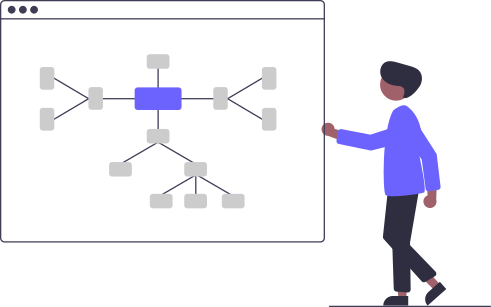
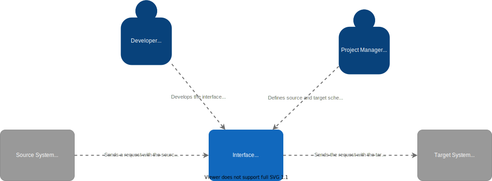

# Data Mapper for dotnet

[](https://www.nuget.org/packages/Buhlergroup.DataMapper/)
[](https://github.com/buhlergroup/data-mapper-dotnet/actions/workflows/CI-build-test.yml)
[](https://sonarcloud.io/dashboard?id=buhlergroup_data-mapper-dotnet)
[](https://sonarcloud.io/dashboard?id=buhlergroup_data-mapper-dotnet)

The **data-mapper-dotnet** allows developers to map data from one schema to another by defining a mapping file that can be managed by non-technical staff.



## Idea

The data mapper can be used as part of an interface between two IT systems.



The developer can focus on implementing the interface while the project manager can define the mapping in a json file.
This way the interface can easily be adjusted if by a project manager without the need of a developer.

## How to use

There are two parts to the library to use it. One is the technical implementation for the developer and one is the mapping for the non-technical staff.

### Library

1. Install the [package via NuGet](https://www.nuget.org/packages/Buhlergroup.DataMapper/)
2. If you're using dependency injection you can use the `AddDataMapper` extension method.

```csharp
using Buhlergroup.DataMapper;
...
var host = new HostBuilder()
    .ConfigureServices(s =>
    {
        ...
        s.AddDataMapper();
    })
    .Build();
```

3. Now an instance of `IMapper` can be injected into any class.

Check the [Development Docs](./docs/Development.md) to get an overview of how the library can be used and how it's structured.

### Mapping

Check the [Mappiong Docs](./docs/Mapping.md) to see how the mapping file works and what it can do for you.

## Contribute

Visit the [contribution page](https://github.com/buhlergroup/data-mapper-dotnet/contribute) to see how you can contribute.
