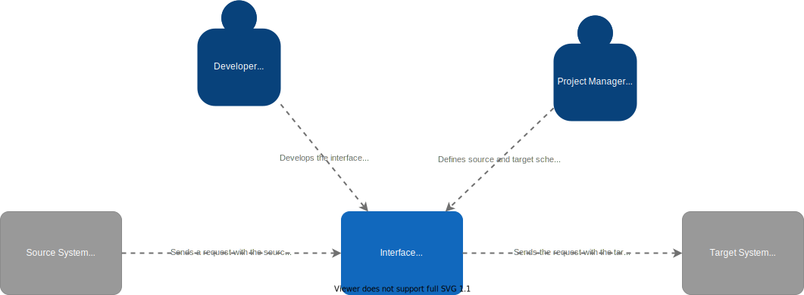
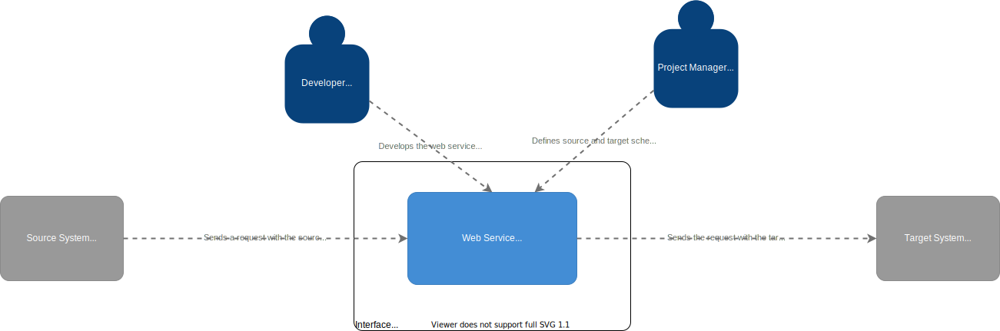
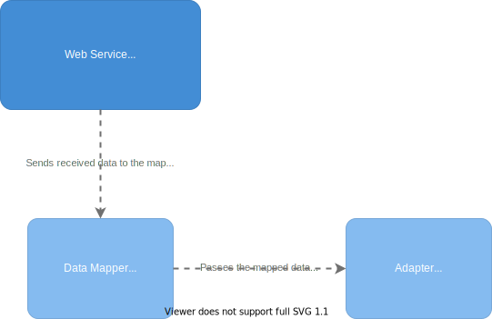
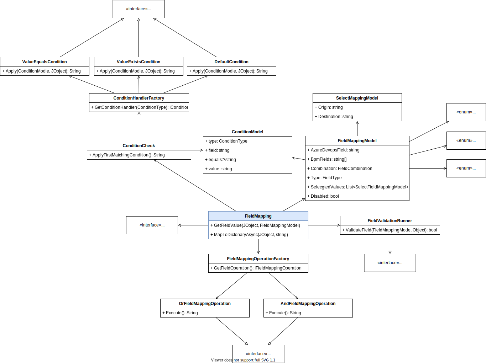

# Development

## System Context & Containers

The data mapper can be used as part of an interface between two IT systems.

The developer is responsible for creating the interface between the application (e.g. a Web Service) and the Project Manager can how the data is mapped between the two systems.

## Component Diagram

The interface (e.g. Azure Function) can use the data mapper library to transform the incoming data to a format that the target system can understand.

## Code

Here's a technical overview of how the code is structured.

The main parts are:

- Conditions
- Validation
- Operations
